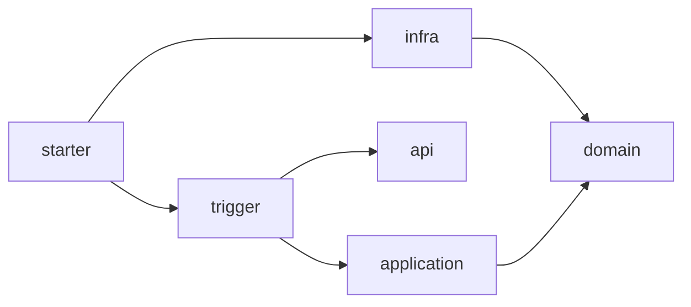

# DDD Hexagonal Playbook

一套面向 Codex 的 DDD 与六边形架构技能包，帮助团队从真实业务场景完成领域建模，在既有 Java/Spring 项目中做出边界清晰、可验证的架构决策，并按统一约束生成可运行的六模块工程。

这个仓库关注的不是“套目录”，而是把领域驱动设计与工程实现之间最容易失真的部分固化为可复用工作流：先识别业务语言、不变式和一致性边界，再决定职责、端口、适配器、事务和技术实现应放在哪里。

## 能力概览

仓库包含三个可以独立使用、也可以串联使用的技能：

| 技能 | 适用场景 | 主要输出 |
| --- | --- | --- |
| `ddd-modeling` | 识别限界上下文、实体、值对象、聚合、领域服务和领域事件 | 建模决策包、当前问题的小型 Context Map、工程交接契约 |
| `java-spring-hex-playbook` | 在现有 Java/Spring 项目中判断职责、依赖、端口、事务、持久化和适配器的位置 | 局部架构、CQRS 等级、事件档位、依赖与一致性影响、验证方式 |
| `ddd-project-create` | 创建团队统一的 Java/Spring DDD 六模块项目 | 完成占位符替换、静态校验并通过 Maven `verify` 的新工程 |

典型协作链路：

```text
真实业务场景
    ↓
ddd-modeling
    ↓ 建模决策包 / 工程交接契约
java-spring-hex-playbook
    ↓ 局部架构、CQRS、事件、职责、端口与适配器
ddd-project-create
    ↓
可编译、可测试的六模块 Java/Spring 工程
```

## 设计原则

- 从业务场景、通用语言、不变式和一致性要求推导模型，不从数据库表或框架结构反推领域。
- 领域层保持框架无关，不依赖 Application、Trigger 或 Infra。
- Application 负责编排用例和控制事务，并拥有由用例消费的出站端口。
- Trigger 承载 HTTP、MQ、RPC、Job 等入站适配器；Infra 实现出站端口。
- 领域事件与技术消息分离；跨边界可靠投递显式考虑 Integration Event、Outbox 和失败语义。
- 所有建议区分架构不变量、团队默认值、条件化方案和示例，避免把技术偏好冒充领域规则。

## 目录结构

```text
ddd-hex-playbook/
├── ddd-modeling/
│   ├── SKILL.md
│   ├── agents/openai.yaml
│   └── references/                 # 聚合、实体、值对象、上下文、领域事件等
├── java-spring-hex-playbook/
│   ├── SKILL.md
│   ├── agents/openai.yaml
│   └── references/                 # 分层、端口、事务、持久化及技术专题
├── ddd-project-create/
│   ├── SKILL.md
│   ├── agents/openai.yaml
│   ├── assets/                     # 工程模板与模板清单
│   ├── references/                 # 模板维护契约
│   ├── scripts/                    # 生成器与静态校验器
│   └── tests/                      # 生成器契约测试
└── README.md
```

`java-spring-hex-playbook` 的专题参考覆盖模块策略、Application 与 Domain 职责、端口与适配器、事务与事件、持久化与查询、错误与契约、命名、测试，以及 MyBatis、Redis、Dubbo、消息、定时任务和 MapStruct 等常见技术。

## 安装

### 前置条件

- 已安装并可使用 Codex。
- 使用项目生成能力时，需要 Python 3.10 或更高版本、JDK 21，以及可访问 Maven 依赖仓库的网络环境。
- 生成项目自带 Maven Wrapper，不要求全局安装 Maven。

### 安装到 Codex

克隆仓库后，将三个技能目录复制到 Codex 的个人技能目录中。

PowerShell：

```powershell
git clone https://github.com/tianquan123/ddd-hex-playbook.git
Set-Location ddd-hex-playbook

$skillsDir = Join-Path $HOME ".codex\skills"
New-Item -ItemType Directory -Force $skillsDir | Out-Null
Copy-Item -Recurse -Force ddd-modeling, java-spring-hex-playbook, ddd-project-create $skillsDir
```

macOS / Linux：

```bash
git clone https://github.com/tianquan123/ddd-hex-playbook.git
cd ddd-hex-playbook

mkdir -p ~/.codex/skills
cp -R ddd-modeling java-spring-hex-playbook ddd-project-create ~/.codex/skills/
```

复制完成后重新打开 Codex 会话。后续更新仓库时，再次覆盖对应目录即可。

## 使用方式

可以在提示词中显式指定技能，也可以直接描述问题，让 Codex 根据技能说明选择合适的工作流。

### 1. 领域建模

适合在写代码前澄清业务边界，也适合审查一个已有模型是否真的由业务规则支撑。

技能会按证据选择两条路径：已有具体场景或模型时走快速评审轨；事实不足、术语冲突或需要划分上下文时走发现建模轨。候选上下文稳定后，只为当前关系生成小型 Context Map 和关系表，不自动扩展成企业全景图。需要持久化到 `CONTEXT.md`、Context Map 或 ADR 时必须由用户明确要求。

```text
使用 $ddd-modeling 分析下面的下单场景。请识别参与者、命令、成功与失败结果、
业务不变式、聚合边界和领域事件；不要从数据库表结构反推模型。

场景：用户提交订单后……
```

```text
使用 $ddd-modeling 审查 Order、OrderItem 和 Payment 当前是否应该属于同一个聚合。
请列出支撑结论的即时一致性规则，以及被排除方案的证据。
```

### 2. Java/Spring 六边形架构决策

适合已有项目中的代码放置、依赖方向、事务、端口、适配器和技术集成问题。

```text
使用 $java-spring-hex-playbook 判断库存扣减应该放在 Application Service、
Domain Service 还是聚合中。请结合现有模块依赖给出理由和验证方式。
```

```text
使用 $java-spring-hex-playbook 评审这个 Spring 事件发布流程。
重点检查事务边界、Domain Event 与 Integration Event 的区分，以及失败恢复方案。
```

涉及领域模型本身是否成立时，先使用 `ddd-modeling`；模型已经明确、问题转为 Java/Spring 工程落位时，再使用 `java-spring-hex-playbook`。

工程技能先检查工程交接契约，再为每个上下文独立选择简单 CRUD/Transaction Script、富领域/Hexagonal 或独立查询/CQRS Read Side。查询设计按六级梯度选择满足证据的最低等级；事件先分类为本地 Domain Event、可靠 Integration Event 或 Event Sourcing，再应用该档位的正确性检查。

### 3. 创建六模块工程

项目生成技能会收集并校验以下输入：

| 输入 | 说明 | 默认值 |
| --- | --- | --- |
| `projectName` | Maven artifact 与目标目录名，只允许小写字母、数字和单连字符 | 必填 |
| `groupId` | Maven Group ID | 必填 |
| `basePackage` | Java 基础包名 | 与 `groupId` 相同 |
| `parentDirectory` | 新项目的父目录 | 当前工作目录 |

示例：

```text
使用 $ddd-project-create 创建项目：
- projectName: ordering-service
- groupId: com.example.ordering
- parentDirectory: D:\workspace
```

生成前，技能会展示项目名、包名、绝对目标路径和模块清单，并要求明确确认。目标目录非空时会拒绝覆盖。生成后会执行静态校验和 Maven `verify`；失败时保留工程，并将构建信息写入 `.ddd-project-create.log`。

## 生成的工程

模板基于 Java 21、Spring Boot 3.3.5 和 Maven Wrapper，生成以下六个模块：

| 模块 | 职责 |
| --- | --- |
| `*-api` | 对外发布的请求与响应契约 |
| `*-domain` | 框架无关的领域模型与端口 |
| `*-application` | 用例编排与事务边界 |
| `*-infra` | 出站适配器与基础设施配置 |
| `*-trigger` | HTTP 等入站适配器 |
| `*-starter` | Spring Boot 启动与模块装配 |

核心依赖方向如下：



模板中的 `sample` 业务切片只用于演示依赖方向、边界转换和测试方式，不代表真实业务模型。完成领域建模后，应删除或替换全部 `SampleOrder` 类型。

生成项目的验证命令：

```powershell
# Windows
.\mvnw.cmd verify
```

```bash
# macOS / Linux
./mvnw verify
```

## 开发与验证

修改生成器、模板、清单或校验器前，请先阅读 [`ddd-project-create/references/template-contract.md`](ddd-project-create/references/template-contract.md)。所有模板变更都应同时通过 Python 契约测试和生成工程的 Maven 构建。

运行生成器测试：

```powershell
python -m unittest discover -s ddd-project-create/tests -p "test_*.py" -v
```

运行技能契约与生成器回归：

```powershell
python -m unittest tests.test_skill_contracts -v
python -m unittest discover -s ddd-project-create/tests -p "test_*.py" -v
```

`evals/runs/` 保存隔离运行的行为证据、评分和前后对比；运行者不会收到评分规则或预期答案。本轮决策质量优化不修改生成器的六模块模板、依赖或生成行为。

静态校验一个已生成项目：

```powershell
python ddd-project-create/scripts/validate_project.py `
  --project-dir D:\workspace\ordering-service `
  --manifest ddd-project-create/assets/template-manifest.json `
  --project-name ordering-service `
  --group-id com.example.ordering `
  --base-package com.example.ordering `
  --project-class OrderingService
```

## 适用边界

这套 Playbook 适合：

- 从业务场景开始设计或审查 DDD 模型；
- 在 Java/Spring 项目中落地六边形架构；
- 统一团队对聚合、事务、端口、适配器和事件的决策语言；
- 快速创建带架构约束和基础测试的六模块项目。

它不会替代业务访谈、上下文映射、ADR 或团队评审，也不会根据数据库表自动生成“领域模型”。当业务事实不足时，技能会优先暴露假设和待确认问题，而不是制造确定答案。

## 贡献指南

- 对规则的修改应说明它属于架构不变量、团队默认值、条件化方案还是示例。
- 新增技术专题时，应明确职责所有者、依赖方向、事务与一致性影响，以及可执行的验证方式。
- 修改模板时，保持六模块依赖方向，并补充相应的契约测试。
- 提交前运行生成器测试，并对生成结果执行 Maven `verify`。

## License

当前仓库尚未提供开源许可证。在许可证补充前，默认保留全部权利；如需复制、分发或用于商业项目，请先联系仓库维护者获得授权。
