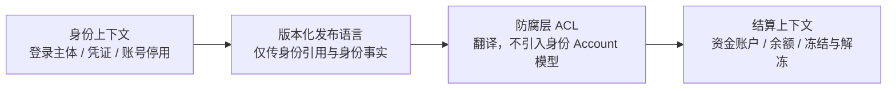

结论：不建议共享“标准 Account”领域模型。这里是同名异义：

- 身份上下文的 Account 是“登录主体”，权威事实是凭证与停用状态。
- 结算上下文的 Account 是“资金账户”，权威事实是余额与资金冻结状态。
- 两者规则、生命周期和事实权威不同；独立发布进一步放大 Shared Kernel 的协同成本。

### 小型 Context Map

建议关系：身份上下文作为身份事实的上游，结算上下文通过防腐层消费版本化契约。双方最多共享稳定的关联标识和消息契约，不共享 Account 实体、状态枚举或生命周期代码。

### 关系表

| 评审项 | 身份上下文 | 结算上下文 | 边界决定 |
|---|---|---|---|
| 本地名称 | 登录账号／登录主体 | 资金账户 | 避免仅使用含混的 `Account` |
| 事实权威 | 登录、凭证、账号停用 | 余额、资金冻结、资金解冻 | 各自拥有并修改本地事实 |
| 关键状态 | 可登录、凭证有效、已停用 | 可用余额、冻结金额、资金账户状态 | 不共享状态枚举 |
| 生命周期 | 围绕身份注册、凭证和停用 | 围绕开户、入账、冻结、解冻 | 不要求同步创建或关闭 |
| 跨界契约 | 发布身份引用及明确命名的身份事实 | 将外部事实翻译成本地输入 | 使用 Published Language + ACL |
| 一致性 | 身份规则在本上下文内即时成立 | 资金规则在本上下文内即时成立 | 跨上下文默认最终一致，不做分布式事务 |
| 发布方式 | 独立发布 | 独立发布 | 契约需版本化和向后兼容 |

### 热点列表

1. **“身份账号停用”不等于“资金冻结”**  
   不应把身份状态直接映射成结算状态。是否限制资金操作需要结算侧明确业务规则、触发条件和审计要求。

2. **关联标识的业务含义尚未明确**  
   需要确认结算账户关联的是登录账号、自然人／法人主体，还是客户档案。可共享的是稳定引用，不一定是身份系统的 `AccountId`。

3. **生命周期不应被强制绑定**  
   身份账号停用后，资金账户可能仍需保留余额、处理退款、清算或合规查询；身份账号创建也未必意味着自动开户。

4. **事件语义必须精确命名**  
   若需要集成，优先使用 `LoginAccountDeactivated` 这类事实名称，避免含混的 `AccountDisabled`；事件中不得暗含“冻结资金”的命令语义。

5. **失败与延迟责任需约定**  
   需要评审消息重复、乱序、延迟和漏消费时，结算系统如何幂等处理、补偿与告警。

6. **排除 Shared Kernel**  
   当前没有“极小、稳定且双方共同拥有的领域模型”证据；共享 Account 会引入协同发布和语义污染。若未来确有稳定交集，也应优先共享契约定义，而非共享领域实体。
